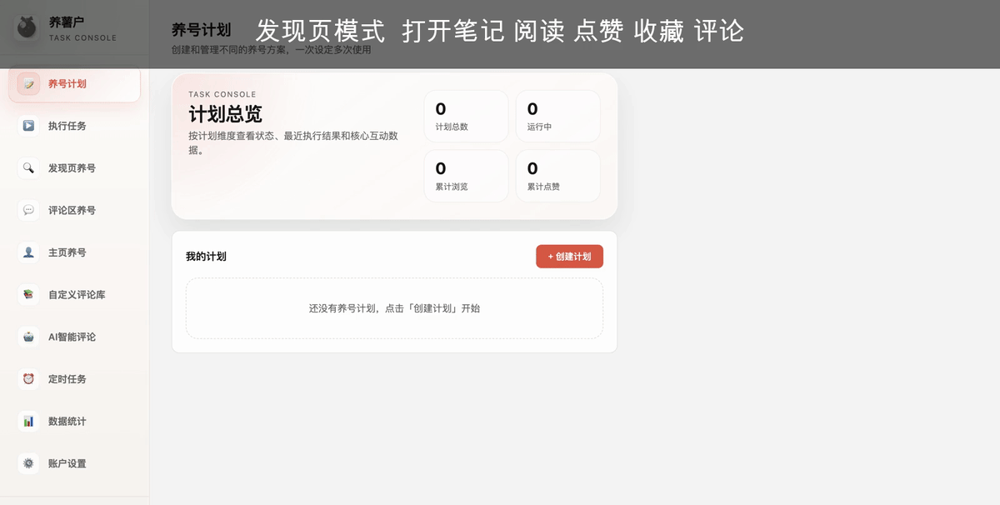
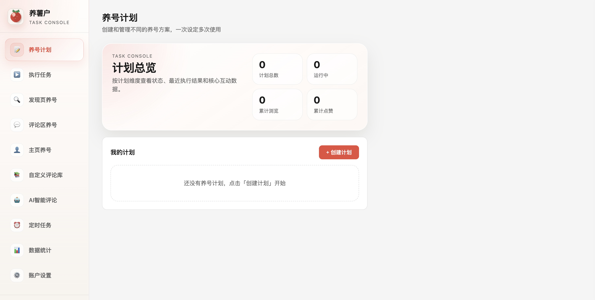

# 养薯户 YangShuHu

<p align="center">
  
</p>

<p align="center">
  一个面向小红书账号冷启动的自动化养号项目。
  <br />
  浏览器扩展 + 后端 API + 官网文档 + 真实可跑的 E2E 验收。
</p>

<p align="center">
  <a href="https://github.com/ChatRichAi/yangshuhu/stargazers"></a>
  <a href="https://github.com/ChatRichAi/yangshuhu/commits/main"></a>
  
  
  
</p>

## 先看演示

> 下面这段预览来自真实验收截图，目的是让访问仓库的人 10 秒内看懂项目能做什么。



<p>
  <a href="./docs/media/demo-preview.mp4">下载 MP4 预览</a> ·
  <a href="./docs/acceptance-summary.json">查看脱敏验收摘要</a>
</p>

## 它解决什么问题

很多“小红书自动化”项目只能做到“页面会跳”，真正到笔记详情后的阅读、点赞、收藏、评论、评论区互动、主页关注，经常是假的，或者一改 DOM 就直接失效。

`养薯户` 不是一个“看起来像自动化”的 demo，而是一个带完整执行链和验证链的工程项目：

- 发现页、评论区、主页三种养号模式
- 阅读、点赞、收藏、评论、评论区互动、主页关注
- 计划配置、实时状态、验证事件、统计数据
- 浏览器扩展、后端 API、官网文档、正式 E2E 命令

## 为什么值得 Star

- 有完整产品形态，不是一次性脚本：`extension + backend + website`
- 有可观测执行链，不是纯黑盒：失败原因、验证事件、任务摘要都能回放
- 有真实验收，不是口头支持：仓库内附带截图、预览和脱敏验收摘要
- 有可复验能力，不是手工演示：`npm run e2e:xhs` 可直接重跑三种模式

## 真实验收结果

最近一次完整验收摘要在 [acceptance-summary.json](./docs/acceptance-summary.json)：

- `accept-explore`: `passed=4`, `failed=0`
- `accept-comment-zone`: `passed=3`, `failed=0`
- `accept-profile`: `passed=5`, `failed=0`

覆盖动作：

- 发现页：打开笔记 -> 阅读 -> 点赞 -> 收藏 -> 评论
- 评论区：打开笔记 -> 命中评论区 -> 评论区互动
- 主页：打开笔记 -> 点赞 -> 收藏 -> 关注 -> 评论

## 实际截图

这些截图都来自真实页面验收，不是设计稿。

### 发现页模式


### 评论区模式


### 主页模式



## 项目结构

```text
.
├── backend/      # FastAPI 后端，提供认证、支付、统计、AI 等接口
├── extension/    # Chrome 扩展核心，负责小红书自动化执行
├── website/      # 官网、文档、博客、定价页
├── scripts/      # 项目级脚本，包含正式 E2E 命令
└── package.json  # 根命令入口，例如 npm run e2e:xhs
```

## 核心能力

### 1. 浏览器扩展自动化

- 计划配置
- 发现页养号
- 评论区养号
- 主页养号
- 自定义评论库
- 实时任务状态
- 验证通过 / 验证失败 / 最近失败原因

### 2. 后端 API

- 用户认证
- 订阅与支付
- OAuth
- 数据统计
- AI 相关接口

### 3. 官网与文档

- Landing Page
- Pricing
- FAQ
- Blog
- Docs

## 快速开始

### 1. 后端

```bash
cd backend
python3 -m venv .venv
source .venv/bin/activate
pip install -r requirements.txt
cp .env.example .env
uvicorn app.main:app --reload
```

### 2. 官网

```bash
cd website
npm install
npm run dev
```

### 3. 扩展

1. 打开 Chrome / Brave
2. 进入 `chrome://extensions`
3. 打开“开发者模式”
4. 选择“加载已解压的扩展程序”
5. 指向 `extension/`

## 正式 E2E 命令

仓库已经内置真实验收命令：

```bash
npm run e2e:xhs
```

它会自动：

- 拉起隔离浏览器实例
- 复用本地已登录 profile
- 加载 `extension/`
- 跑发现页 / 评论区 / 主页三种模式
- 产出截图和验收报告

常用环境变量：

- `XHS_E2E_BROWSER_PATH`
- `XHS_E2E_PROFILE_ROOT`
- `XHS_E2E_PROFILE_NAME`
- `XHS_E2E_USER_DATA_DIR`
- `XHS_E2E_DEBUG_PORT`
- `XHS_E2E_EXTENSION_ID`

## 适合谁

- 想研究小红书养号自动化链路的人
- 想做浏览器自动化产品 MVP 的人
- 想看“扩展 + 官网 + 后端 + E2E”完整工程的人
- 想把“脚本”升级成“项目”的人

## Roadmap

- [ ] 补录一段真实浏览器操作视频，替换当前 GIF 预览
- [ ] 把 E2E 结果接到 CI 或 nightly job
- [ ] 支持更多养号模板和策略市场
- [ ] 补充更细粒度的失败分类与告警

## 免责声明

本项目用于自动化工程、浏览器扩展架构和执行链路验证的研究与实践。请在遵守目标平台规则与当地法律法规的前提下使用。

---

如果你希望看到的不是“又一个自动化脚本”，而是一个**真的能跑、真的能验、真的能扩展**的小红书自动化项目，这个仓库值得你点一个 Star。
